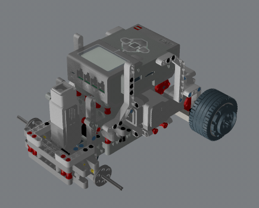
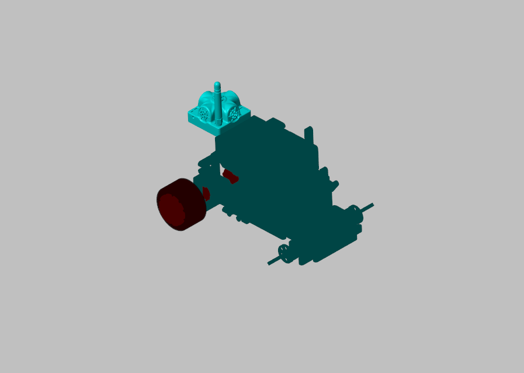

# Simscape_Robot_LEGO

<table>
  <tr>
    <td width="50%">
      
    </td>
    <td width="50%"****>
      
    </td>
  </tr>
  <tr>
    <td style="text-align: center;">Complete piece by piece custom LEGO robot model</td>
    <td style="text-align: center;">LEGO robot model, grouped by main parts for simulation in Simulink and Simscape Multibody</td>
  </tr>
</table>

If you use it, especially  if it is used to the publish something about it, cite the following publication, thanks, it is open to use, it is the only condition, credits to the authors:
[Carbonell, Rafael and Cuenca, Ángel and Casanova, Vicente and Pizá, Ricardo and Salt Llobregat, Julián J. - Dual-Rate Extended Kalman Filter Based Path-Following Motion Control for an Unmanned Ground Vehicle: Realistic Simulation - MDPI - Sensors 2021](https://doi.org/10.3390/s21227557) - [Video](https://youtu.be/eWQBw9Ew0UM)
